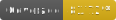

# Url-Shortener

   

Die App ermöglicht Nutzern eines Office365-Tenants das Erstellen und Verwalten von [Short Urls](https://en.wikipedia.org/wiki/URL_shortening), die frei im Internet zugänglich sind. App inkl. Datenbank wurden für eine Docker-Umgebung entwickelt.

## Anspruch des Entwicklers

In diesem Projekt ging es dem Entwickler um das Erfahrungsammeln mit Technologien (MongoDB, OAuth2). **Sicherheitsaspekte sind** nicht ignoriert, aber auch **nicht fokussiert worden**.

## Installation und Konfiguration

Damit die App korrekt installiert werden kann, müssen entsprechende Berechtigungen vorliegen (z.B. mit der Rolle _Globaler Administrator_), um eine AzureAD Enterprise App im Office365-Tenant anzulegen. Diese wird zur Authentifizierung mittels OAuth2 (implizit) benötigt.

### AzureAD Enterprise App

Zunächst muss man sich im [AAD Portal](https://aad.portal.azure.com) anmelden.

**Hinweis:** Die Menüs _App registrations_ und _Enterprise applications_ sind nicht gleich, auch wenn beide die Verwaltung von Apps ermöglichen. Bitte daher genau auf die Navigation achten.

#### App registrieren

Die App kann registriert werden, indem man zu _Azure Active Directory_ und dann _App registrations_ navigiert und _New Registration_ wählt.
Anschließend vergibt man einen frei wählbaren Namen für die App und erlaubt lediglich die Nutzung der App durch einen Tenant (_Single Tenant_).

#### App konfigurieren

Die neu erstellte App öffnet sich nach der Registrierung automatisch oder kann über _App registrations_ geöffnet werden.
Es müssen eine Redirect URI für den OAuth-Flow, ein App Secret für die Node.js-App und eine Rolle für die Konfiguration von App-Administratoren angelegt werden.

##### Redirect URI

Um eine Redirect URI anzulegen, wählt man im Menü _Authentication_ _Add a plattform_. Anschließend wählt man "Web" (o.a. "Web Server Application") aus und gibt die Redirect URI nach folgendem Schema ein:

https://example.com:3800/oauth/callback/

_"example.com" und "3800" stehen für Domain und Port, über die der Url-Shortener verfügbar sein soll._

Unter "Authentication" muss angegeben werden, dass "ID tokens" und **nicht** "Access tokens" erstellt werden sollen.
Zusätzlich müssen weiter unten unter "Supported account types" "Single tenant" ausgewählt und unter "Advanced settings" die Option "Allow public client flows" deaktiviert werden.

##### App Secret

Um ein App Secret anzulegen, wählt man im Menü _Certificates & secrets_ und dann den Reiter _Client secrets_ aus. Anschließend _New Client Secret_ wählen, eine Beschreibung angeben, eine Gültigkeitsdauer festlegen und _Add_ klicken.
Für die spätere Verwendung muss das Secret (_Value_) kopiert und temporär gespeichert werden.

##### Admin-Rolle

Um Administratoren zu verwalten, wird eine entsprechende Rolle benötigt. Diese kann unter _App roles_ angelegt werden. Besonderns wichtig ist, dass _Display name_ "AdminRole" (ohne Anführungszeichen) lautet, "User/Groups" als _Allowed member types_ ausgewählt und die Rolle aktiviert wird.

Anschließend über _All services_ zu _Enterprise applications_ navigieren und die neu angelegte App auswählen. Über _Users and groups_ können Administratoren berechtigt werden, indem Nutzer mit der zuvor angelegten Admin-Rolle hinzugefügt werden.

### Node.js App

Zunächst wird das Git-Repository geklont. Auf dem Branch `master` befindet sich die aktuellste Version der App. Dieser muss ausgecheckt sein. Anschließend müssen Dateien angelegt werden, die verschiedene Umgebungsvariablen für App und Datenbank beinhalten.

#### .db.env

Die Datei `.db.env` wird im Wurzelverzeichnis des Repository angelegt und beinhaltet Name und Passwort vom Admninistrator (Root) und eines einfachen Datenbanknutzers, der von der App für den Zugriff auf die MongoDB-Instanz benötigt wird.

```
MONGO_ROOT_USER=mydatabaserootuser
MONGO_ROOT_USER_PASS=myrootpassword
MONGO_API_USER=mydatabaseuser
MONGO_API_USER_PASS=mypassword
```

#### .app.env

Die Datei `.app.env` wird im Repository unter `/src/config` angelegt und beinhaltet neben den selben Zugangsdaten aus ".db.env" weitere Daten, die für die Kommunikation mit dem Office365-Tenant benötigt werden.

```
MONGO_API_USER=mydatabaseuser
MONGO_API_USER_PASS=mypassword
AAD_OAUTH_CLIENT_ID=Application (client) ID
AAD_OAUTH_TENENT_ID=Directory (tenant) ID
AAD_OAUTH_APP_SECRET=Secret Value
AAD_OAUTH_APP_OBJECT_ID=Object ID
AAD_OAUTH_REDIRECT_UTI=https://example.com:3800/oauth/callback/
```

Die Werte für Application (client) ID und Application (tenant) ID können aus _Overview_ der App unter _App registrations_ bezogen werden.
Der Wert des Secret wurde bereits im Vorfeld nach dem Anlegen des App Secret gespeichert.
Der Wert für Object ID ist im _Overview_ der App unter _Enterprise applications_ verfügbar.

### Ausführung

Sobald die App installiert und konfiguriert wurde, kann sie mithilfe von Docker-Compose genutzt werden. Mit dem Befehl `env $(cat .db.env) && docker-compose up -d --build` werden Umgebungsvariablen geladen, sowie die Docker-Container gebaut und bereitgestellt. Die Umgebungsvariablen werden einmalig zum Bauen benötigt. 

## Nutzung

### Nutzertypen

Es gibt drei Gruppen, zwischen denen die App unterscheidet.

#### Anonymer Nutzer

Anonyme Nutzer sind Nutzer, die keine Nutzer des Office365-Tenant sind oder in diesem zur Zeit nicht angemeldet sind. Sie können lediglich Short Urls aufrufen, aber selbst keine anlegen, verwalten und weitere Informationen zu Short Urls aufrufen.

#### Einfacher Nutzer

Einfache Nutzer sind im Office365-Tenant angemeldete Nutzer, die die Rolle "AdminRole" nicht besitzen. Sie können Short Urls anlegen, selbst angelegte Short Urls verwalten und diese auch löschen. Zudem können sie weitere Informationen eigener Short Urls aufrufen.

#### Administrator

Administratoren sind angemeldete Nutzer des Office365-Tenant, die die Rolle "AdminRole" besitzen. Sie können sämtliche Funktionen für eigene Short Urls und die anderer Nutzer aufrufen.

## Dokumentation

Die aktuelle Dokumentation der API befindet sich in `swagger.html`. Nicht enthalten sind die Endpunkte zur Authentifikation mittels OAuth2.